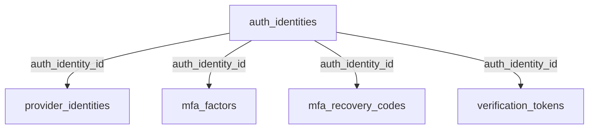
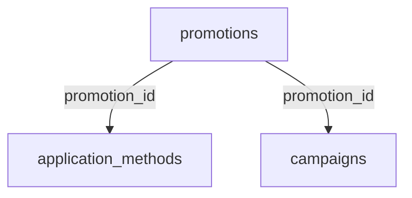
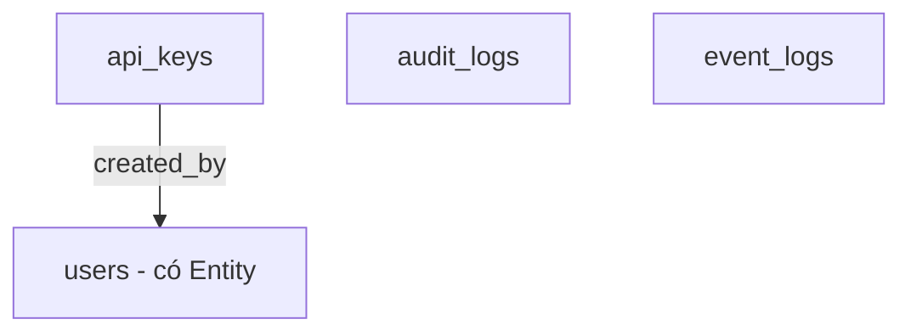

# Báo Cáo: Thống Kê Toàn Bộ Các Bảng Chưa Có Entity/DTO Java

> **Ngày:** 2026-08-02
> **Mục đích:** Thống kê các bảng trong database chưa được triển khai (không có Entity, Repository, DTO, Service, Controller) trong codebase Spring Boot.

---

## 1. Tổng Quan

Database có **81 bảng**, bao gồm:

- **72 bảng** từ [`V1__baseline.sql`](../../../src/main/resources/db/migration/V1__baseline.sql) (database dump gốc, kiểu Medusa.js + Supabase)
- **8 bảng** từ các migration V4 → V11 (hệ thống identity riêng của dự án)
- **1 bảng hệ thống** `flyway_schema_history`

| Phân loại | Số lượng |
|-----------|----------|
| Tổng số bảng trong DB | **81** |
| Bảng hệ thống (`flyway_schema_history`) | 1 |
| Bảng nghiệp vụ đã có Entity Java | **39** |
| Bảng nghiệp vụ chưa triển khai | **41** |

---

## 2. Bảng ĐÃ CÓ Entity Java (39/80 bảng nghiệp vụ)

### 2.1 Từ V1 Baseline (31 bảng)

| # | DB Table | Java Entity | Module |
|---|----------|-------------|--------|
| 1 | `carts` | `Cart` | cart |
| 2 | `cart_items` | `LineItem` | cart |
| 3 | `products` | `Product` | catalog |
| 4 | `product_categories` | `Category` | catalog |
| 5 | `product_collections` | `ProductCollection` | catalog |
| 6 | `product_images` | `ProductImage` | catalog |
| 7 | `product_options` | `ProductOption` | catalog |
| 8 | `product_option_values` | `ProductOptionValue` | catalog |
| 9 | `product_types` | `ProductType` | catalog |
| 10 | `product_variants` | `ProductVariant` | catalog |
| 11 | `regions` | `Region` | catalog |
| 12 | `stores` | `Store` | catalog |
| 13 | `fulfillments` | `Fulfillment` | fulfillment |
| 14 | `fulfillment_items` | `FulfillmentItem` | fulfillment |
| 15 | `users` | `User` | identity |
| 16 | `customers` | `Customer` | identity |
| 17 | `customer_addresses` | `Address` | identity |
| 18 | `inventory_items` | `InventoryItem` | inventory |
| 19 | `inventory_levels` | `InventoryLevel` | inventory |
| 20 | `reservation_items` | `ReservationItem` | inventory |
| 21 | `notifications` | `Notification` | notification |
| 22 | `orders` | `Order` | order |
| 23 | `order_items` | `OrderItem` | order |
| 24 | `order_status_history` | `OrderStatusHistory` | order |
| 25 | `payments` | `Payment` | payment |
| 26 | `payment_collections` | `PaymentCollection` | payment |
| 27 | `payment_sessions` | `PaymentSession` | payment |
| 28 | `refunds` | `Refund` | payment |
| 29 | `discounts` | `Discount` | promotion |
| 30 | `discount_conditions` | `DiscountCondition` | promotion |
| 31 | `discount_rules` | `DiscountRule` | promotion |

### 2.2 Từ Migration V4-V11 (8 bảng)

| # | Migration | DB Table | Java Entity | Module |
|---|-----------|----------|-------------|--------|
| 32 | V4 | `permission` | `Permission` | identity |
| 33 | V5 | `role` | `Role` | identity |
| 34 | V6 | `role_permission` | `RolePermission` | identity |
| 35 | V7 | `user_admins` | `UserAdmin` | identity |
| 36 | V8 | `user_admin_roles` | `UserAdminRole` | identity |
| 37 | V9 | `user_admin_permissions` | `UserAdminPermission` | identity |
| 38 | V10 | `login_history` | `LoginHistory` | identity |
| 39 | V11 | `revoked_tokens` | `RevokedToken` | identity |

> **Lưu ý quan trọng:** Module identity dùng bảng `role` (số ít, từ V5). Bảng `roles` (số nhiều, từ V1) là bảng khác và **không được sử dụng**.

---

## 3. Bảng CHƯA CÓ Entity Java (41/80 bảng nghiệp vụ)

### 3.1 Auth & Identity (6 bảng từ V1)

| # | Bảng | Mục đích thiết kế |
|---|------|-------------------|
| 1 | `auth_identities` | Danh tính xác thực kiểu Supabase/GoTrue. Liên kết với provider_identities, MFA, verification_tokens qua cột `id` |
| 2 | `provider_identities` | Đăng nhập qua Google/GitHub (FK `auth_identity_id`) |
| 3 | `mfa_factors` | Xác thực 2 yếu tố: TOTP, SMS (FK `auth_identity_id`) |
| 4 | `mfa_recovery_codes` | Mã khôi phục MFA (FK `auth_identity_id`) |
| 5 | `verification_tokens` | Token xác minh email/phone, reset password (FK `auth_identity_id`) |
| 6 | `roles` | Bảng roles với cột `permissions` JSONB — KHÁC bảng `role` của identity module (V5) |

### 3.2 API, Audit & Events (3 bảng từ V1)

| # | Bảng | Mục đích thiết kế |
|---|------|-------------------|
| 7 | `api_keys` | Quản lý API key: `token_hash`, `type` (secret/publishable), `created_by`, `last_used_at`, `revoked_at`. FK → `users` |
| 8 | `audit_logs` | Nhật ký kiểm toán: `entity_type`, `entity_id`, `action`, `changes` (JSONB diff), `performed_by`, `ip_address`, `user_agent` |
| 9 | `event_logs` | Log sự kiện hệ thống: `event_type`, `severity`, `source`, `message`, `metadata` |

### 3.3 Promotion Engine đầy đủ (3 bảng từ V1)

| # | Bảng | Mục đích thiết kế |
|---|------|-------------------|
| 10 | `promotions` | Promotion code gốc: `code`, `type`, `status`, `starts_at`, `ends_at` |
| 11 | `application_methods` | Cách áp dụng promotion: `type` (fixed/percentage), `target_type` (order/shipping/item), `allocation` (total/across), `value`, `max_quantity`. FK `promotion_id` |
| 12 | `campaigns` | Chiến dịch marketing: `budget` (JSONB), `starts_at`, `ends_at`. FK `promotion_id` |

### 3.4 Order mở rộng (7 bảng từ V1)

| # | Bảng | Mục đích thiết kế |
|---|------|-------------------|
| 13 | `order_addresses` | Địa chỉ giao hàng/thanh toán của order (`type`: shipping/billing) |
| 14 | `order_carts` | Join table order ↔ cart |
| 15 | `order_credit_lines` | Dòng store credit của order: `amount`, `reference` |
| 16 | `order_fulfillments` | Join table order ↔ fulfillment |
| 17 | `order_summaries` | Tổng kết tài chính: `item_total`, `tax_total`, `shipping_total`, `paid_total`, `refunded_total` |
| 18 | `order_timelines` | Timeline trạng thái: `previous_status` → `new_status`, `action_by`, `action_type` |
| 19 | `order_transactions` | Giao dịch tài chính: `amount`, `currency_code`, `reference` |

### 3.5 Pricing Engine (4 bảng từ V1)

| # | Bảng | Mục đích thiết kế |
|---|------|-------------------|
| 20 | `price_lists` | Bảng giá: `type` (sale/override), `status` (draft/active), `starts_at`, `ends_at` |
| 21 | `price_sets` | Nhóm giá (container cho nhiều price theo currency) |
| 22 | `prices` | Giá cụ thể: `price_set_id`, `currency_code`, `amount`, `min_quantity`, `max_quantity` |
| 23 | `price_rules` | Rule chọn giá: `attribute`, `operator`, `value` (JSONB) |

### 3.6 Shipping Engine (3 bảng từ V1)

| # | Bảng | Mục đích thiết kế |
|---|------|-------------------|
| 24 | `shipping_profiles` | Hồ sơ vận chuyển: `name`, `type` (default/custom) |
| 25 | `shipping_options` | Tùy chọn vận chuyển: `price_type` (flat_rate/calculated), `amount`. FK region + profile |
| 26 | `shipping_option_rules` | Rule chọn shipping option: `attribute`, `operator`, `value` (JSONB) |

### 3.7 Cart mở rộng (2 bảng từ V1)

| # | Bảng | Mục đích thiết kế |
|---|------|-------------------|
| 27 | `cart_adjustments` | Điều chỉnh giá giỏ hàng: `code`, `amount`, `description`. FK `cart_item_id` |
| 28 | `cart_tax_lines` | Dòng thuế giỏ hàng: `code`, `rate`, `amount`. FK `cart_item_id` |

### 3.8 Fulfillment mở rộng (2 bảng từ V1)

| # | Bảng | Mục đích thiết kế |
|---|------|-------------------|
| 29 | `fulfillment_addresses` | Địa chỉ giao hàng của fulfillment. FK `fulfillment_id` |
| 30 | `fulfillment_labels` | Nhãn vận chuyển: `tracking_number`, `tracking_url`, `label_url`, `carrier`. FK `fulfillment_id` |

### 3.9 Payment mở rộng (1 bảng từ V1)

| # | Bảng | Mục đích thiết kế |
|---|------|-------------------|
| 31 | `captures` | Lịch sử capture payment: `payment_id`, `amount`, `created_by`. FK `payment_id` |

### 3.10 Customer mở rộng (2 bảng từ V1)

| # | Bảng | Mục đích thiết kế |
|---|------|-------------------|
| 32 | `customer_groups` | Nhóm khách hàng: `name`, `metadata` |
| 33 | `customer_group_customers` | Join table customer ↔ group |

### 3.11 Catalog mở rộng (5 bảng từ V1)

| # | Bảng | Mục đích thiết kế |
|---|------|-------------------|
| 34 | `product_category_products` | Join table product ↔ category |
| 35 | `product_tags` | Tags sản phẩm: `value`, `metadata` |
| 36 | `product_product_tags` | Join table product ↔ tag |
| 37 | `product_variant_inventory_items` | Join table variant ↔ inventory_item |
| 38 | `product_variant_price_sets` | Join table variant ↔ price_set |

### 3.12 Reference & Khác (3 bảng từ V1)

| # | Bảng | Mục đích thiết kế |
|---|------|-------------------|
| 39 | `currencies` | Danh sách tiền tệ: `code`, `name`, `symbol`, `decimal_digits` (chỉ dùng làm FK reference bởi nhiều bảng, chưa có Entity) |
| 40 | `region_countries` | Quốc gia trong region: `country_code`, `country_name`. FK `region_id` |
| 41 | `store_currencies` | Tiền tệ của store: `store_id`, `currency_code`, `is_default` |

---

## 4. Sơ Đồ Mối Quan Hệ Của Các Bảng Chưa Triển Khai

### 4.1 Nhóm Auth (Supabase-style)

### 4.2 Nhóm Promotion Engine

### 4.3 Nhóm API & Audit

---

## 5. Kết Luận

- Database schema được import từ **Medusa.js** (ecommerce platform) kết hợp hệ thống auth kiểu **Supabase/GoTrue**.
- Codebase Java Spring Boot hiện tại mới triển khai **39/80 bảng nghiệp vụ**, tập trung vào các module: cart, catalog, fulfillment, identity (hệ thống riêng với role/permission/user_admin), inventory, notification, order, payment, promotion (chỉ Discount cơ bản).
- **41 bảng còn lại** thuộc về 8 nhóm tính năng lớn chưa được build:
  1. **Auth nâng cao** (6): auth_identities, provider_identities, mfa_factors, mfa_recovery_codes, verification_tokens, roles
  2. **API & Audit** (3): api_keys, audit_logs, event_logs
  3. **Promotion Engine** (3): promotions, application_methods, campaigns
  4. **Pricing Engine** (4): price_lists, price_sets, prices, price_rules
  5. **Shipping Engine** (3): shipping_profiles, shipping_options, shipping_option_rules
  6. **Order mở rộng** (7): order_addresses, order_carts, order_credit_lines, order_fulfillments, order_summaries, order_timelines, order_transactions
  7. **Cart/Fulfillment/Payment mở rộng** (5): cart_adjustments, cart_tax_lines, fulfillment_addresses, fulfillment_labels, captures
  8. **Join tables & Reference** (10): customer_groups, customer_group_customers, product_tags, product_product_tags, product_category_products, product_variant_inventory_items, product_variant_price_sets, currencies, region_countries, store_currencies

---

## 6. Nguồn Tham Khảo

- Migration baseline: `src/main/resources/db/migration/V1__baseline.sql`
- Migration bổ sung: `V4__Create_Permission_Table.sql` → `V11__Create_Revoked_Tokens_Table.sql`
- Các Entity Java nằm trong thư mục `modules/*/src/main/java/com/v8n/*/domain/entity/`
